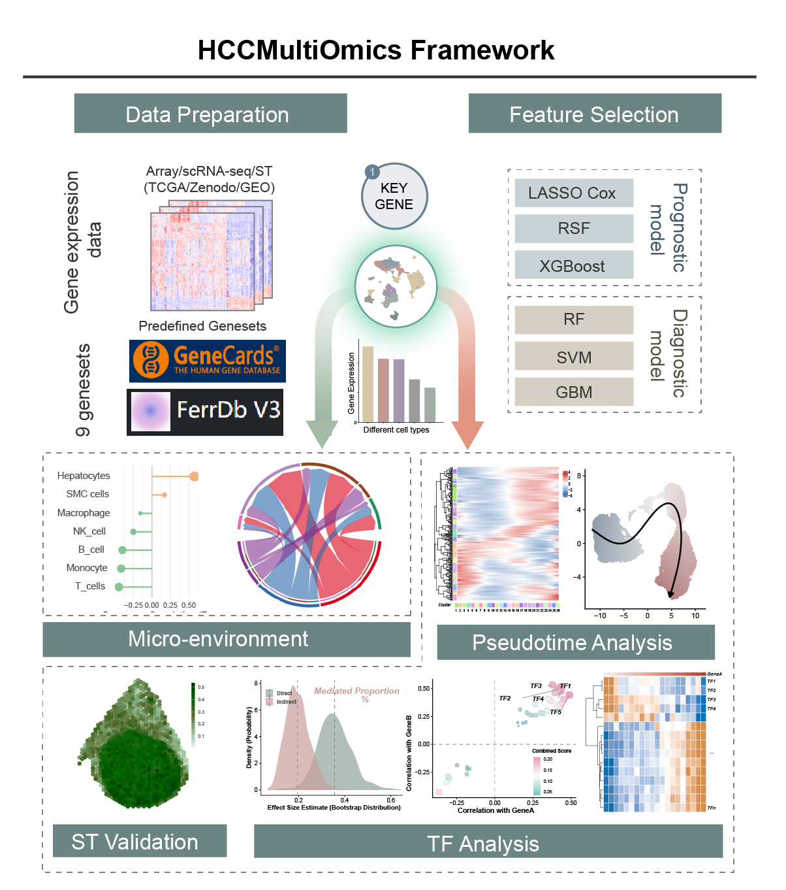

<!-- README.md is generated from README.Rmd. Please edit that file -->



# HCCMultiOmics

[](https://github.com/hepatology-will/HCCMultiOmics/actions/workflows/R-CMD-check.yaml)

HCCMultiOmics provides an integrative analysis workflow for hepatocellular carcinoma (HCC) multi-omics data, spanning from bulk RNA-seq biomarker discovery to single-cell mechanism validation.

## Installation

```r
# Install devtools if not already installed
install.packages("devtools")

# Install HCCMultiOmics
devtools::install_github("hepatology-will/HCCMultiOmics")
```

## Important: Working Directory

**All scripts must be run from the HCCMultiOmics package root directory:**

```bash
cd /path/to/HCCMultiOmics
```

This is critical because:
- Scripts read input data from relative paths (`data/`, `inst/scripts/`)
- Output files are saved to `hcc_output/`
- Step N reads results from Step N-1

---

## Workflow Overview

The analysis workflow is **decision-tree based** - the next step depends on which cell type shows the highest target gene expression:

```
Step 1: Bulk Analysis → Candidate Genes
         ↓
Step 2: Single-cell Visualization → Identify cell type with highest gene expression
         ↓
    ┌────┴────┐
    ↓         ↓
 Hepatocytes  Non-hepatocytes
 (Malignant)  (TME cells)
    ↓         ↓
Step 3-5    End
(Mechanism  (Microenvironment
 +SCENIC)    analysis)
```

**Key Decision Point:** Step 2 determines whether your target gene is expressed most in **malignant hepatocytes** or **non-hepatocytes** (immune/stromal cells). This dictates the downstream analysis path.

---

## Prerequisites

### Required Data Files

Place the following files in the package root directory:

| File | Description | Required |
|------|-------------|----------|
| `TCGA_Expr_Mat.rda` | TCGA expression matrix | Yes |
| `TCGA_Clin_Data.rda` | TCGA clinical data | Yes |
| `TCGA_LIHC_DEGs.rda` | TCGA LIHC differential genes | Yes |
| `HCC_sc_data.rda` | Single-cell data | Yes (or use `--data auto`) |

### For Step 4 (SCENIC Analysis)

Download SCENIC database files:

```bash
cd /path/to/HCCMultiOmics
./inst/scripts/download_scenic_files.sh
```

Requires Python environment:
```bash
pip install pandas numpy pyscenic arboreto ctxcore
```

---

## Step-by-Step Guide

### Step 1: Bulk RNA-seq Analysis

**Purpose:** Identify candidate prognostic genes using machine learning on TCGA bulk RNA-seq data.

**What it does:**
1. Intersects your selected gene set with TCGA differential genes
2. Trains three ensemble ML models (LASSO, RSF, XGBoost)
3. Identifies candidate genes that are prognostic
4. Builds diagnostic model for the candidate genes

**How to run:**

```bash
# Using built-in gene sets
Rscript inst/scripts/step1_bulk_analysis.R --builtin 1

# Using custom gene set
Rscript inst/scripts/step1_bulk_analysis.R --custom genes.csv

# Set random seed for reproducibility
Rscript inst/scripts/step1_bulk_analysis.R --builtin 1 --seed 123
```

**Built-in Gene Sets:**
| Index | Gene Set |
|-------|----------|
| 1 | Ferroptosis_FerrDb |
| 2 | Cuproptosis_FerrDb |
| 3 | Disulfidptosis |
| 4 | Autosis |
| 5 | immunogonic_cell_death |
| 6 | mitotic_death |
| 7 | parthanatos |

**Output:** `hcc_output/step1/`
- `candidate_genes.csv` - List of candidate genes for next step
- `diag_result.rds` - Diagnostic model results
- Various PDF plots (model performance, Venn diagrams)

**Next step:** Select one candidate gene from the output and proceed to Step 2.

---

### Step 2: Single-cell Visualization

**Purpose:** Visualize target gene expression across different cell types in single-cell data to determine the downstream analysis path.

**What it does:**
1. Shows target gene expression on UMAP (FeaturePlot + Violin)
2. Calculates mean expression (Type 1) and positive cell ratio (Type 2) per cell type
3. Identifies which cell type has the highest expression

**How to run:**

```bash
# Replace YOUR_GENE with your selected gene name
Rscript inst/scripts/step2_singlecell.R --gene YOUR_GENE

# Auto-download single-cell data from Zenodo if not available locally
Rscript inst/scripts/step2_singlecell.R --gene YOUR_GENE --data auto
```

**Output:** `hcc_output/step2/`
- `sc_landscape.pdf` - Overall single-cell landscape
- `{GENE}_landscape.pdf` - Gene expression on UMAP
- `{GENE}_stat_type1.pdf` - Mean expression by cell type
- `{GENE}_stat_type2.pdf` - Positive cell ratio by cell type
- `top_cells.rds` - Cell types with highest expression (for next step)
- `target_gene.rds` - Target gene name (for next step)

**Key Decision:** Look at the output plots to decide:
- If **highest expression in hepatocytes (malignant cells)** → Go to Step 3 (Mechanism Analysis)
- If **highest expression in non-hepatocytes (immune/stromal cells)** → Microenvironment analysis (workflow ends here)

---

### Step 3: Mechanism Analysis

**Purpose:** Analyze the molecular mechanism of your target gene in malignant hepatocytes.

**What it does:**
1. Performs trajectory analysis
2. Calculates stemness scores
3. Analyzes intercellular communication (ligand-receptor)
4. Generates mechanism correlation plots

**How to run:**

```bash
# Use Type 1 if mean expression showed better separation
Rscript inst/scripts/step3_mechanism.R --type 1

# Use Type 2 if positive cell ratio showed better separation
Rscript inst/scripts/step3_mechanism.R --type 2
```

**Important:** This step automatically reads:
- Target gene from `hcc_output/step2/target_gene.rds`
- Top expressing cell types from `hcc_output/step2/top_cells.rds`

**Output:** `hcc_output/step3/`
- Trajectory analysis plots
- Stemness analysis results
- Ligand-receptor communication analysis
- `scenic_input.csv` - Expression matrix for SCENIC (if in hepatocytes path)

**Next step:** If working with hepatocytes, proceed to Step 4.

---

### Step 4: SCENIC Analysis

**Purpose:** Build gene regulatory network using SCENIC to identify transcription factors (TFs) regulating your target gene.

**What it does:**
1. Constructs co-expression network (GRNBoost2)
2. Prunes network with motif enrichment (CTX)
3. Calculates AUC scores for regulons

**How to run:**

```bash
# First ensure SCENIC database files are downloaded
./inst/scripts/download_scenic_files.sh

# Run SCENIC (10 threads, adjust as needed)
bash inst/scripts/step4_scenic.sh 10
```

**Important:** Requires Python environment with pyscenic installed.

**Output:** `hcc_output/step4/`
- `regulons.csv` - TF regulons
- `AUC_matrix.csv` - AUC scores for each cell

**Next step:** Proceed to Step 5 for downstream analysis.

---

### Step 5: SCENIC Downstream Analysis

**Purpose:** Identify key transcription factors and analyze regulatory relationships.

**What it does:**
1. Performs TF enrichment analysis
2. Screens for mediator TFs
3. Visualizes TF-target gene relationships
4. Generates heatmaps and network plots

**How to run:**

```bash
# --target: Your target gene from Step 2
# --downstream: Downstream gene of interest
Rscript inst/scripts/step5_scenic_analysis.R --target YOUR_GENE --downstream DOWNSTREAM_GENE
```

**Example:**
```bash
Rscript inst/scripts/step5_scenic_analysis.R --target EZH2 --downstream SLC7A11
```

**Output:** `hcc_output/step5/`
- TF enrichment heatmaps
- Mediator TF analysis plots
- Network visualizations

---

## Quick Reference

| Step | Command | Input | Output |
|------|---------|-------|--------|
| 1 | `Rscript inst/scripts/step1_bulk_analysis.R --builtin 1` | Gene set | candidate_genes.csv |
| 2 | `Rscript inst/scripts/step2_singlecell.R --gene GENE` | candidate_genes.csv | top_cells.rds |
| 3 | `Rscript inst/scripts/step3_mechanism.R --type 1/2` | target_gene.rds | scenic_input.csv |
| 4 | `bash inst/scripts/step4_scenic.sh 10` | scenic_input.csv | regulons.csv |
| 5 | `Rscript inst/scripts/step5_scenic_analysis.R --target GENE --downstream GENE2` | AUC_matrix.csv | TF analysis |

---

## Citation

```bibtex
@software{HCCMultiOmics,
  author = {Zhuo Chen},
  title = {HCCMultiOmics: An Integrative Analysis Framework for HCC Multi-omics},
  year = {2025},
  url = {https://github.com/hepatology-will/HCCMultiOmics}
}
```

## License

MIT License
